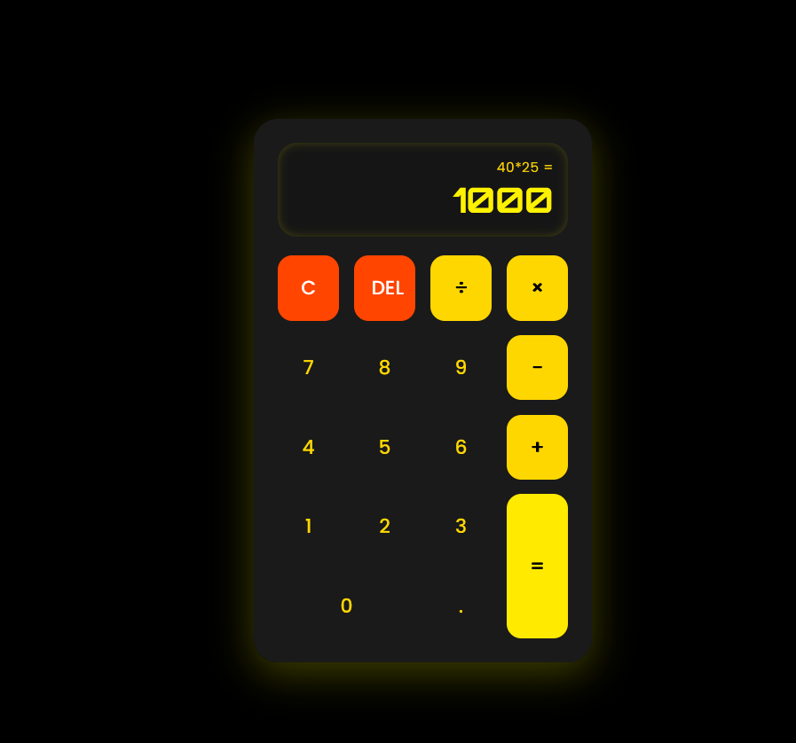

# Calculator App

A simple and responsive calculator web application that performs basic arithmetic operations such as addition, subtraction, multiplication, and division. This project is built using HTML, CSS, and JavaScript and demonstrates basic front-end development skills.

---

## 📌 Features

* Perform addition, subtraction, multiplication, and division
* Clean and user-friendly interface
* Responsive design
* Instant calculation results

---

## 🛠 Technologies Used

* HTML
* CSS
* JavaScript

---

## 🚀 How to Run the Project

1. Clone or download the repository.
2. Open the project folder.
3. Open the `index.html` file in your web browser.

---

## 📂 Project Structure

calculator-app
│
├── index.html
├── style.css
├── script.js
└── README.md

---

## 🎯 Purpose of the Project

This project was created to practice and demonstrate fundamental web development concepts such as DOM manipulation, event handling, and user interface design using JavaScript.

---

## 👨‍💻 Author

Muhammad Fahad

---

## ⭐ Show Your Support

If you like this project, consider giving it a star on GitHub!

## 🧮 Calculator App

Here’s what it looks like 👇

